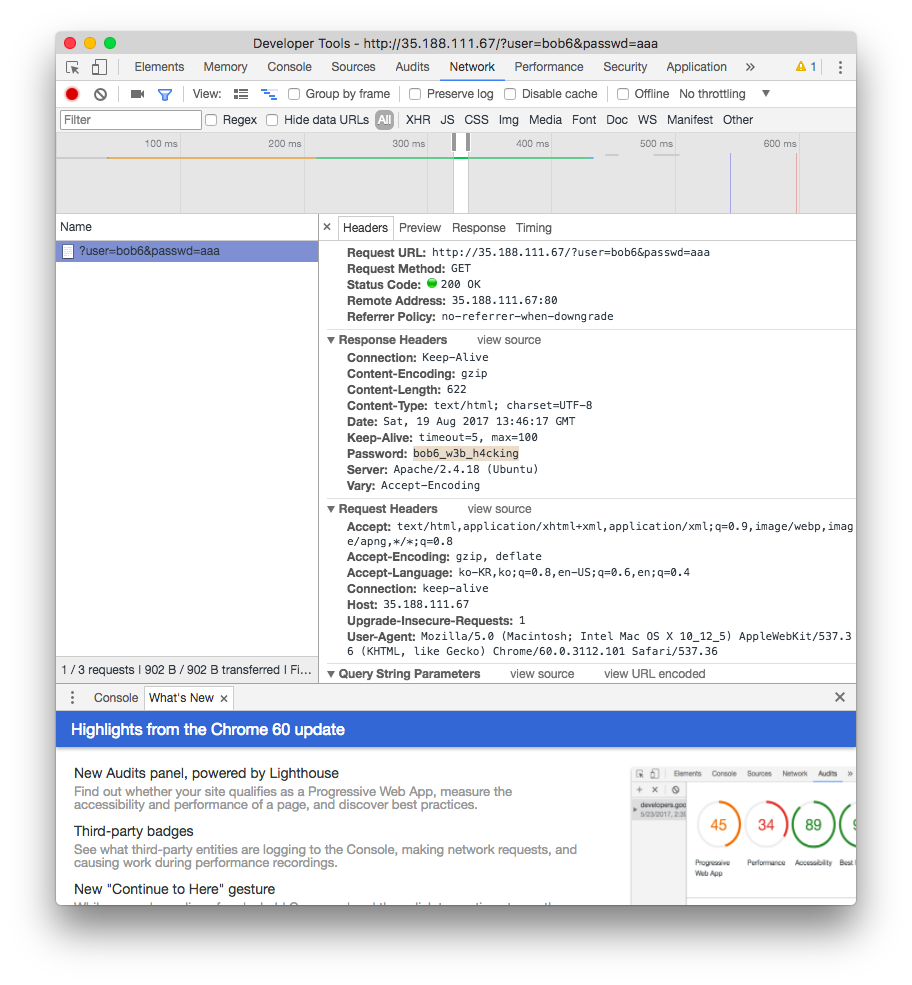

# [2017_BOB] \[WEB] No SQL Injection 

###Problem

서버 - 35.188.111.67

```html
<!DOCTYPE html>


<!-- login id: bob6 -->
<!-- No sql injection -->

<html lang="en">
  <head>
    <meta charset="utf-8">
    <meta name="viewport" content="width=device-width, initial-scale=1, shrink-to-fit=no">
    <link rel="stylesheet" href="https://maxcdn.bootstrapcdn.com/bootstrap/4.0.0-beta/css/bootstrap.min.css" integrity="sha384-/Y6pD6FV/Vv2HJnA6t+vslU6fwYXjCFtcEpHbNJ0lyAFsXTsjBbfaDjzALeQsN6M" crossorigin="anonymous">
  </head>
  <body style="background-color:rgb(238,238,238);">    
    <div class="container">

      <form class="form-signin" name='bob6'>
        <h2 class="form-signin-heading">Please sign in</h2>
        <label for="inputuserid" class="sr-only">User ID</label>
        <input type="userid" id="inputuserid" name="user" class="form-control" placeholder="User ID" required autofocus>
        <label for="inputPassword" class="sr-only">Password</label>
        <input type="password" id="inputPassword" name="passwd" class="form-control" placeholder="Password" required>
        <input type='submit' class="btn btn-lg btn-primary btn-block" value='Sign In' />
      </form>
    </div>
  </body>
</html>

```

주석에 bob6으로 로그인하라고 써있다. CTF 진행 중에 No SQL Injection 수십번 시도했으나 실패했다. 대회가 끝나고 들어보니 아주 어이없는 방식으로 문제가 풀렸다.


### Solution

아이디는 bob6, 비밀번호는 아무거나 입력하고 접속했다. (http://35.188.111.67/?user=bob6&passwd=aaa)



세상에.. 플래그가 헤더에 나와있다. (문제 의도를 전혀 모르겠다=_=)