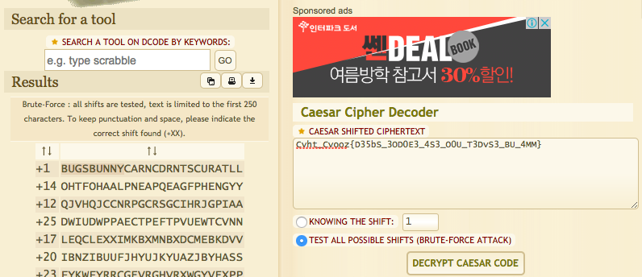
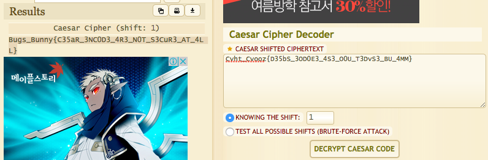

# [2017_BugsBunny] \[Crypto] crypto-15

```

# -*- pbqvat: hgs-8 -*-
#/hfe/ova/rai clguba
vzcbeg fgevat
# Synt : Cvht_Cvooz{D35bS_3OD0E3_4S3_O0U_T3DvS3_BU_4MM}
qrs rapbqr(fgbel, fuvsg):
  erghea ''.wbva([ 
            (ynzoqn p, vf_hccre: p.hccre() vs vf_hccre ryfr p)
                (
                  ("nopqrstuvwxyzabcdefghijklm"*2)[beq(pune.ybjre()) - beq('n') + fuvsg % 26], 
                  pune.vfhccre()
                )
            vs pune.vfnycun() ryfr pune 
            sbe pune va fgbel 
        ])


qrs qrpbqr(fgbel,xrl):
	cnff


vs __anzr__ == '__znva__':
	xrl = [_LBHE_XRL_URER_]
	cevag qrpbqr("Cvht_Cvooz{D35bS_3OD0E3_4S3_O0U_T3DvS3_BU_4MM}",xrl)
```

`Cvht_Cvooz{D35bS_3OD0E3_4S3_O0U_T3DvS3_BU_4MM}`를 복호화하면 되는 듯 합니다. flag 형식이 `Bugs_Bunny{}`이므로 시저 암호 같아 보입니다. Cesar puzzle solver online을 검색해서 풀었습니다.






