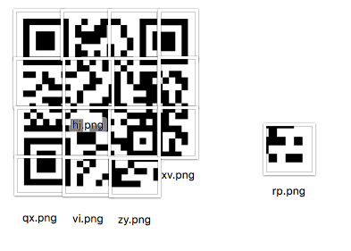

# [2017_BugsBunny] \[Forensic] task85

### Problem

task85.zip을 풀면 압축 파일과 여러가지 그림 파일이 나옵니다.

압축 파일은 비밀번호가 걸려있고, 그림 파일 중에는 qr 코드로 보이는 그림 조각들이 보입니다.


###Solution



그 파일들을 조합하면 이렇게 됩니다. 이러한 qr코드가 나오는데 imagemagick 툴을 이용하여 이미지 파일들을 합칠 수 있습니다.

```
$ magick convert +append ax.png nb.png nn.png cx.png task1.png
$ magick convert +append dq.png hj.png hm.png im.png task2.png
$ magick convert +append mb.png mj.png pr.png xv.png task3.png
$ magick convert +append qx.png vi.png zy.png task4.png
$ magick convert +append task4.png rp.png task5.png
$ magick convert -append task1.png task2.png task3.png task5.png task.png
```


QR 코드가 완성 되며 Reader를 통해 값을 추출해보면 `== 34Sy_P4SSW0Rd_H4X0r ==`가 나옵니다. 이것이 압축 해제 비밀번호입니다.

압축을 해제해보면 `flag.txt`와 `Readme` 파일이 생기는데 플래그는 `Readme` 파일에 2진수로 인코딩되어있습니다.

`binary to string online`을 구글에 검색해보면 온라인 컨버터가 많이 나오는데 그 중에서 골라서 쓰시면 됩니다.

`Bugs_Bunny{2b97263beb70d0f659bdb93cc5291d0a}` 