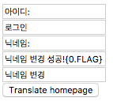
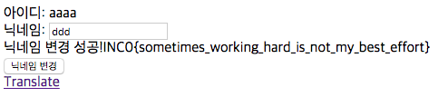

# [2017_Inc0gnito] \[WEB] monika

### Problem

문제 서버 - http://prob.nagi.moe:9094/

```python
#coding: utf-8
import json
from flask import Flask
from flask import Response
from flask import request, session
from flask import url_for, redirect
from flask import render_template

from flask.json import JSONEncoder
app = Flask(__name__)
#auth me, i dare you
FLAG = "INC0{..........}"
app.secret_key = "..................."
DEFAULT_SET={}
DEFAULT_SET['login_id'] = 'ID: '
DEFAULT_SET['login'] = 'Login'
DEFAULT_SET['nickname'] = 'Nickname: '
DEFAULT_SET['status'] = 'Changed nickname!'
DEFAULT_SET['change'] = 'Change nickname'
KOREAN_SET = {}
KOREAN_SET['login_id'] = u'아이디: '
KOREAN_SET['login'] = u'로그인'
KOREAN_SET['nickname'] = u'닉네임: '
KOREAN_SET['status'] = u'닉네임 변경 성공!'
KOREAN_SET['change'] = u'닉네임 변경'
class account:
    def __init__(self, _id, nickname, flag):
        self._id = _id
        self.nickname = nickname
        self.FLAG = flag
    def __str__(self):
        return self.nickname
    def __repr__(self):
        return self.nickname
    def __unicode__(self):
        return unicode(self.nickname)
@app.route("/status", methods=['GET', 'POST'])
def status():
    try:
        t1 = session['t1']
        t3 = session['t3']
        t4 = session['t4']
        t5 = session['t5']
    except:
        session['t1'] = DEFAULT_SET['login_id']
        session['t3'] = DEFAULT_SET['nickname']
        session['t4'] = DEFAULT_SET['status']
        session['t5'] = DEFAULT_SET['change']
        t1 = session['t1']
        t3 = session['t3']
        t4 = session['t4']
        t5 = session['t5']
        pass
    try:
        me = session['account']
        me = account(me['id'], me['nickname'], me['FLAG'])
        _nickname = request.form.get("nickname")
        if _nickname is not None:
            session['account']['nickname'] = _nickname
            me.nickname = _nickname
            return render_template("status.html", t1=t1, t3=t3, t5=t5, _id=me._id, nickname=me.nickname, t4=t4.format(me))
        else:
            return render_template("status.html", _id=me._id, nickname=me.nickname,t1=t1,t3=t3,t5=t5)
    except:
        raise
        return redirect(url_for("main"))
@app.route("/translate", methods=['GET', 'POST'])
def translate():
    t1 = request.form.get("t1")
    t2 = request.form.get("t2")
    t3 = request.form.get("t3")
    t4 = request.form.get("t4")
    t5 = request.form.get("t5")
    render = False
    if t1 is None:
        render = True
        session['t1'] = KOREAN_SET['login_id']
    else:
        session['t1'] = t1
    if t2 is None:
        render = True
        session['t2'] = KOREAN_SET['login']
    else:
        session['t2'] = t2
    if t3 is None:
        render = True
        session['t3'] = KOREAN_SET['nickname']
    else:
        session['t3'] = t3
    if t4 is None:
        render = True
        session['t4'] = KOREAN_SET['status']
    else:
        session['t4'] = t4
    if t5 is None:
        render = True
        session['t5'] = KOREAN_SET['change']
    else:
        session['t5'] = t5
    if(render):
        return render_template("translate.html", t1=session['t1'], t2=session['t2'], t3=session['t3'], t4=session['t4'], t5=session['t5'])
    else:
        return redirect(url_for("status"))
@app.route("/", methods=['GET', 'POST'])
def main():
    _id = request.form.get("id")
    try:
        t1 = session['t1']
    except:
        session['t1'] = DEFAULT_SET['login_id']
        t1 = session['t1']
        pass
    try:
        t2 = session['t2']
    except:
        session['t2'] = DEFAULT_SET['login']
        t2 = session['t2']
        pass
    try:
        t3 = session['t3']
    except:
        session['t3'] = DEFAULT_SET['nickname']
        t3 = session['t3']
        pass
    try:
        t4 = session['t4']
    except:
        session['t4'] = DEFAULT_SET['status']
        t4 = session['t4']
        pass
    try:
        t5 = session['t5']
    except:
        session['t5'] = DEFAULT_SET['change']
        t5 = session['t5']
        pass
    if _id is not None:
        me = {}
        me['id'] = _id
        me['nickname'] = ""
        me['FLAG'] = FLAG
        session['account'] = me
        return redirect(url_for("status"))
    
    return render_template("main.html", t1=t1, t2=t2)

if __name__ == "__main__":
    app.run(host='0.0.0.0', port=9094)

```

account라는 클래스에 FLAG가 저장되어 있습니다. 하지만 어떤 곳에서도 FLAG를 출력해주진 않습니다.


### 취약점

`t4=t4.format(me)`에서 취약점이 발생합니다. t4에 포멧스트링을 입력해주면 me 클래스에 있는 내용을 불러올 수 있습니다. `{}`는 nickname, `{0}`도 닉네임을 불러옵니다. `{0.FLAG}` 하면 FLAG를 불러올 수 있습니다.


### Exploit



