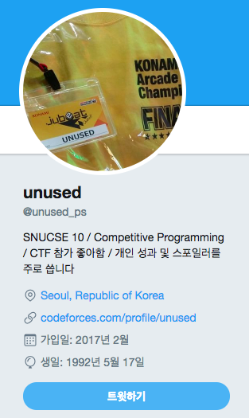
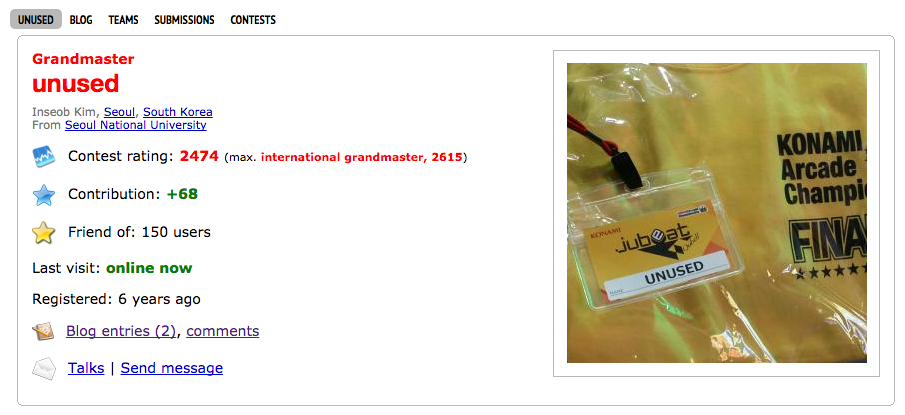
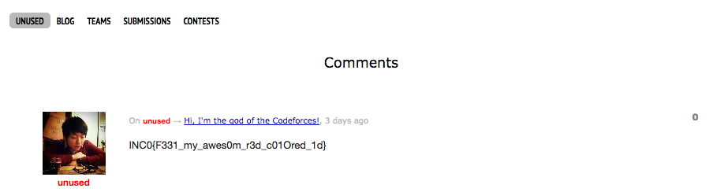

# [2017_Inc0gnito] \[Recon] unused

### Problem

```
Our operator unused is a good hacker, but he is also a good competitive programmer.
One night, I played CTF and thought I need to study programming as well.
I want to be like him, so help me how did he studied programming!
Hint: Why his ID is unused, not unused?
```

해커 unused가 프로그래밍을 공부한 방법을 구해야합니다.


### Solution

Recon 유형은 sns나 blog 같은 것을 이용하여 신상을 터는 것(?)과 비슷하다고 합니다.

unused라는 닉네임을 쓰고 CTF를 하는 사람을 찾아봤더니 트위터 주소(`https://twitter.com/unused_ps`)를 알 수 있었습니다.



프로필에 수상한 링크(`http://codeforces.com/profile/unused`)가 있었습니다. 들어가보니 프로그래밍 관련 사이트임을 알 수 있었습니다.



comment(`http://codeforces.com/comments/with/unused`)를 눌렀더니 플래그가 있었습니다.

